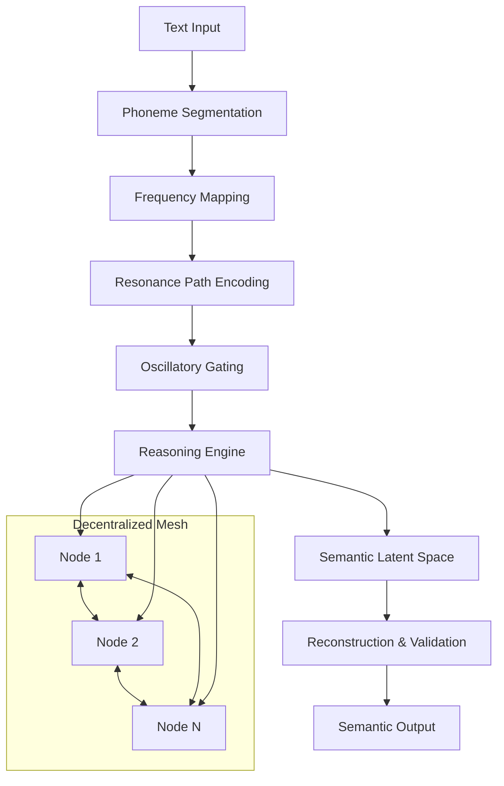

# Design Document: URCM Reasoning System

## Overview

The Unified μ-Resonance Cognitive Mesh (URCM) represents a paradigm shift from token-based AI systems to a frequency-based, oscillatory reasoning architecture. The system replaces discrete symbolic processing with continuous phoneme-derived representations that achieve semantic understanding through resonance stabilization rather than probabilistic prediction.

The core innovation lies in μ-convergence: a process where semantic stability emerges through the interaction of oscillatory nodes, each representing meaning as stable attractor states. This approach eliminates common issues in current AI systems including infinite loops, hallucination drift, and vocabulary explosion while providing natural termination conditions and self-correction mechanisms.

## Architecture

### High-Level System Architecture



### Core Processing Pipeline

1. **Input Processing**: Text → Phoneme Sequence → Frequency Path
2. **Resonance Encoding**: Frequency Path → Temporal Resonance State
3. **Oscillatory Gating**: Global Rhythm Modulation → Phase-Locked Processing
4. **Reasoning Engine**: Multi-Path Competition → μ-Convergence → Attractor Selection
5. **Semantic Projection**: Resonance State → Compressed Latent Representation
6. **Reconstruction**: Latent → Frequency Path → Validation

## Components and Interfaces

### Phoneme-Frequency Mapper

**Interface:**
```python
class PhonemeFrequencyMapper:
    def __init__(self, phoneme_set: Set[str], frequency_dim: int = 24):
        self.phoneme_space = phoneme_set  # Sanskrit-derived phonemes
        self.K = frequency_dim  # Frequency vector dimensionality
        
    def map_phoneme(self, phoneme: str) -> np.ndarray:
        """Map single phoneme to frequency vector"""
        
    def map_sequence(self, phonemes: List[str]) -> np.ndarray:
        """Map phoneme sequence to frequency path"""
        
    def enforce_smoothness(self, path: np.ndarray) -> np.ndarray:
        """Apply smoothness constraints to frequency path"""
```

**Key Features:**
- Sanskrit phoneme set for complete articulatory coverage
- K-dimensional frequency vectors (K ∈ [16, 32])
- Smoothness constraints: ||f(pi) - f(pj)||² minimization
- Abstract resonance bands (not literal audio frequencies)

### Resonance Path Encoder

**Interface:**
```python
class ResonancePathEncoder:
    def __init__(self, input_dim: int, hidden_dim: int, output_dim: int):
        self.temporal_encoder = self._build_encoder()  # RNN/Transformer/Custom
        
    def encode_path(self, frequency_path: np.ndarray) -> np.ndarray:
        """Convert frequency path to resonance state"""
        
    def get_resonance_state(self, path: np.ndarray) -> ResonanceState:
        """Generate complete resonance state with metadata"""
```

**Implementation Options:**
- RNN-based temporal processing for sequential dynamics
- Transformer architecture for attention-based encoding
- Custom oscillator network for direct resonance modeling

### Oscillatory Gating System

**Interface:**
```python
class OscillatoryGating:
    def __init__(self, base_frequency: float = 1.0):
        self.omega = base_frequency
        self.phase = 0.0
        
    def global_rhythm(self, t: float) -> float:
        """Generate global oscillation g(t) = cos(2πωt)"""
        
    def apply_gating(self, resonance_state: np.ndarray, t: float) -> np.ndarray:
        """Apply gated resonance: ỹt = yt ⊙ σ(Wg·g(t) + b)"""
        
    def reset_phase(self):
        """Reset oscillation phase for error recovery"""
```

**Key Properties:**
- Global rhythm synchronization across all processing units
- Periodic reset mechanism prevents runaway activation
- Phase-locked reasoning with natural resolution points
- Cyclic cognition patterns

### μ-Convergence Reasoning Engine

**Interface:**
```python
class MuConvergenceEngine:
    def __init__(self, convergence_threshold: float = 1e-6):
        self.mu_threshold = convergence_threshold
        self.active_paths = []
        
    def calculate_mu(self, path: ResonancePath) -> float:
        """Calculate μ = ρ/χ = semantic_density/transformation_cost"""
        
    def compete_paths(self, paths: List[ResonancePath]) -> ResonancePath:
        """Multi-path competition based on μ-stability"""
        
    def check_convergence(self, delta_mu: float) -> bool:
        """Determine if reasoning should terminate (Δμ → 0)"""
        
    def stabilize_reasoning(self, input_state: ResonanceState) -> ResonanceState:
        """Main reasoning loop with automatic termination"""
```

**Core Algorithm:**
1. Generate multiple competing reasoning paths
2. Calculate μ-stability for each path: μ = ρ/χ
3. Select path with highest μ-value
4. Monitor Δμ for convergence
5. Terminate when Δμ approaches zero

### Hopfield-Kuramoto Attractor Network

**Interface:**
```python
class AttractorNetwork:
    def __init__(self, num_oscillators: int, coupling_strength: float):
        self.N = num_oscillators
        self.K = coupling_strength
        self.phases = np.random.uniform(0, 2*np.pi, num_oscillators)
        self.frequencies = np.random.normal(1.0, 0.1, num_oscillators)
        
    def update_phases(self, dt: float):
        """Kuramoto dynamics: dθi/dt = ωi + (K/N)Σsin(θj - θi)"""
        
    def find_attractors(self) -> List[AttractorState]:
        """Identify stable phase patterns representing meanings"""
        
    def navigate_attractors(self, start: AttractorState, target: AttractorState) -> Path:
        """Reasoning as movement between attractor states"""
        
    def eigenvalue_control(self) -> Dict[str, float]:
        """Monitor system stability through eigenvalue analysis"""
```

**Attractor Dynamics:**
- Each oscillator: phase θᵢ, frequency ωᵢ
- Coupling strength determines synchronization behavior
- Stable patterns = semantic meanings
- Reasoning = attractor navigation
- Decision = attractor dominance

### Semantic Latent Space Manager

**Interface:**
```python
class SemanticLatentSpace:
    def __init__(self, input_dim: int, latent_dim: int):
        self.projection_matrix = self._initialize_projection()
        self.drift_constraints = self._setup_constraints()
        
    def project_to_latent(self, resonance_state: np.ndarray) -> np.ndarray:
        """Project resonance state to compressed latent space z = S(y)"""
        
    def ensure_reconstructability(self, latent_vector: np.ndarray) -> bool:
        """Verify latent representation can be reconstructed"""
        
    def apply_drift_constraints(self, latent_vector: np.ndarray) -> np.ndarray:
        """Apply μ-threshold constraints to prevent drift"""
        
    def task_adaptation(self, task_context: TaskContext) -> np.ndarray:
        """Adapt latent space for specific reasoning tasks"""
```

**Properties:**
- Compressed representation for efficiency
- Task-dependent adaptation
- Drift-constrained through μ-thresholds
- Reconstructability guarantees

### Reconstruction and Self-Correction System

**Interface:**
```python
class ReconstructionSystem:
    def __init__(self, latent_dim: int, frequency_dim: int):
        self.decoder = self._build_decoder()
        self.error_handlers = self._setup_error_handling()
        
    def reconstruct_path(self, latent_vector: np.ndarray) -> np.ndarray:
        """Reconstruct frequency path F̂ = D(z)"""
        
    def calculate_reconstruction_loss(self, original: np.ndarray, reconstructed: np.ndarray) -> float:
        """Compute L_recon = ||F̂ - F||₁"""
        
    def handle_frequency_drift(self, drifted_path: np.ndarray) -> np.ndarray:
        """Project back to nearest valid phoneme region"""
        
    def handle_semantic_collapse(self, collapsed_state: ResonanceState) -> ResonanceState:
        """Apply reconstruction anchoring recovery"""
        
    def handle_oscillation_desync(self, desync_state: OscillationState) -> OscillationState:
        """Perform phase reset for synchronization recovery"""
```

**Error Recovery Mechanisms:**
- Frequency drift → phoneme region projection
- Semantic collapse → reconstruction anchoring
- Oscillation desync → phase reset
- Continuous validation through reconstruction loss

### Decentralized Mesh Node

**Interface:**
```python
class MeshNode:
    def __init__(self, node_id: str, neighbors: List[str]):
        self.id = node_id
        self.phoneme_encoder = PhonemeFrequencyMapper()
        self.resonance_processor = ResonancePathEncoder()
        self.mu_calculator = MuConvergenceEngine()
        self.local_memory = LocalMemory()
        
    def process_local_input(self, input_data: Any) -> ResonanceState:
        """Process input using local components"""
        
    def exchange_mu_signals(self, neighbors: List[MeshNode]) -> Dict[str, float]:
        """Exchange Δμ and phase alignment signals (no raw data)"""
        
    def synchronize_patterns(self, neighbor_signals: Dict[str, float]) -> bool:
        """Achieve μ pattern synchronization with mesh"""
        
    def maintain_privacy(self) -> bool:
        """Ensure no raw data leaves the node"""
```

**Mesh Properties:**
- No central authority or single point of failure
- Privacy-preserving through signal-only communication
- Fault-tolerant through redundant processing
- Scalable through decentralized architecture
- Global knowledge emergence through μ synchronization

## Data Models

### Core Data Structures

```python
@dataclass
class PhonemeSequence:
    phonemes: List[str]
    source_text: str
    language_hint: Optional[str] = None

@dataclass
class FrequencyPath:
    vectors: np.ndarray  # Shape: (sequence_length, K)
    smoothness_score: float
    phoneme_mapping: List[Tuple[str, int]]  # (phoneme, vector_index)

@dataclass
class ResonanceState:
    resonance_vector: np.ndarray
    mu_value: float
    stability_score: float
    oscillation_phase: float
    timestamp: float

@dataclass
class AttractorState:
    phase_pattern: np.ndarray
    eigenvalues: np.ndarray
    stability_type: str  # "stable", "unstable", "saddle"
    semantic_label: Optional[str] = None

@dataclass
class ReasoningPath:
    initial_state: ResonanceState
    intermediate_states: List[ResonanceState]
    final_state: ResonanceState
    mu_trajectory: List[float]
    convergence_achieved: bool
    termination_reason: str

@dataclass
class MeshSignal:
    sender_id: str
    delta_mu: float
    phase_alignment: float
    timestamp: float
    signal_type: str  # "sync", "convergence", "error"
```

### Validation and Constraints

```python
class DataValidation:
    @staticmethod
    def validate_frequency_path(path: FrequencyPath) -> bool:
        """Ensure frequency path meets smoothness constraints"""
        
    @staticmethod
    def validate_mu_value(mu: float) -> bool:
        """Ensure μ value is within valid range"""
        
    @staticmethod
    def validate_resonance_state(state: ResonanceState) -> bool:
        """Ensure resonance state is stable and reconstructable"""
        
    @staticmethod
    def validate_mesh_signal(signal: MeshSignal) -> bool:
        """Ensure mesh signal contains no raw data"""
```

## Error Handling

### Error Classification and Recovery

**Frequency Drift Errors:**
- **Detection**: Monitor frequency vector deviation from valid phoneme regions
- **Recovery**: Project drifted vectors back to nearest valid phoneme space
- **Prevention**: Enforce smoothness constraints during path generation

**Semantic Collapse Errors:**
- **Detection**: Reconstruction loss exceeds threshold (L_recon > τ)
- **Recovery**: Apply reconstruction anchoring to restore semantic grounding
- **Prevention**: Continuous validation through reconstruction loop

**Oscillation Desynchronization:**
- **Detection**: Phase coherence drops below critical threshold
- **Recovery**: Global phase reset across all oscillatory components
- **Prevention**: Monitor phase alignment in real-time

**μ-Convergence Failures:**
- **Detection**: Δμ fails to approach zero within timeout
- **Recovery**: Path competition reset with alternative hypotheses
- **Prevention**: Multi-path redundancy and stability monitoring

**Mesh Communication Errors:**
- **Detection**: Node synchronization failure or signal corruption
- **Recovery**: Isolate faulty node, redistribute processing load
- **Prevention**: Redundant mesh connections and signal validation

### Error Recovery Protocols

```python
class ErrorRecoverySystem:
    def __init__(self):
        self.recovery_strategies = {
            'frequency_drift': self.handle_frequency_drift,
            'semantic_collapse': self.handle_semantic_collapse,
            'oscillation_desync': self.handle_oscillation_desync,
            'mu_convergence_failure': self.handle_convergence_failure,
            'mesh_communication_error': self.handle_mesh_error
        }
        
    def detect_and_recover(self, system_state: SystemState) -> SystemState:
        """Main error detection and recovery loop"""
        
    def log_error_patterns(self, error_type: str, context: Dict) -> None:
        """Track error patterns for system improvement"""
```

## Testing Strategy

The URCM system requires a dual testing approach combining traditional unit testing with property-based testing to ensure both specific correctness and universal properties hold across the complex oscillatory dynamics.

### Unit Testing Approach

**Component-Level Testing:**
- Test individual components (PhonemeMapper, ResonanceEncoder, etc.) with specific examples
- Validate error handling mechanisms with known failure cases
- Test integration points between system components
- Verify mathematical computations (μ calculation, oscillation dynamics)

**Integration Testing:**
- Test end-to-end processing pipelines with sample inputs
- Validate mesh node communication protocols
- Test error recovery scenarios with simulated failures
- Verify system behavior under various load conditions

### Property-Based Testing Configuration

**Testing Framework:** We will use Hypothesis (Python) for property-based testing, configured with minimum 100 iterations per test to ensure comprehensive coverage of the continuous parameter spaces.

**Test Tagging Format:** Each property test will be tagged with:
```python
# Feature: urcm-reasoning-system, Property {number}: {property_description}
```

**Key Testing Principles:**
- Property tests verify universal behaviors across all valid inputs
- Unit tests validate specific examples and edge cases
- Both approaches are essential for comprehensive validation
- Property tests catch subtle bugs in continuous parameter spaces
- Unit tests provide concrete examples of expected behavior

The combination ensures that the system maintains correctness across the infinite space of possible frequency paths, oscillation states, and reasoning scenarios while also validating specific critical behaviors.

## Correctness Properties

*A property is a characteristic or behavior that should hold true across all valid executions of a system—essentially, a formal statement about what the system should do. Properties serve as the bridge between human-readable specifications and machine-verifiable correctness guarantees.*

The URCM system's correctness is defined through universal properties that must hold across all possible inputs, oscillation states, and reasoning scenarios. These properties ensure the system maintains semantic stability, prevents drift, and achieves reliable termination.

### Property 1: Phoneme-to-Frequency Mapping Consistency
*For any* valid phoneme from the Sanskrit-derived phoneme set, the frequency mapper should produce a vector in K-dimensional space where K ∈ [16, 32], and the mapping should be deterministic and consistent across all invocations.
**Validates: Requirements 1.2**

### Property 2: Frequency Path Smoothness
*For any* sequence of adjacent phonemes, the resulting frequency vectors should satisfy smoothness constraints such that ||f(pi) - f(pj)||² is minimized, ensuring natural transitions in frequency space.
**Validates: Requirements 1.3**

### Property 3: Text-to-Frequency Pipeline Completeness
*For any* valid text input, the complete processing pipeline (text → phoneme sequence → frequency path) should produce a valid frequency path with proper dimensionality and smoothness properties.
**Validates: Requirements 1.4**

### Property 4: μ-Convergence Reasoning Stability
*For any* reasoning scenario with multiple competing paths, the system should calculate μ = ρ/χ for each path, select the path with highest μ-stability, and automatically terminate when Δμ approaches zero, preventing infinite loops.
**Validates: Requirements 2.1, 2.2, 2.3, 2.4**

### Property 5: Oscillatory Gating Mathematical Correctness
*For any* resonance state and time t, the oscillatory gating mechanism should apply the correct mathematical transformations: global rhythm g(t) = cos(2πωt) and gated resonance ỹt = yt ⊙ σ(Wg·g(t) + b), creating cyclic cognition patterns.
**Validates: Requirements 3.1, 3.2, 3.3**

### Property 6: Attractor-Based Semantic Representation
*For any* semantic meaning processed by the system, it should be encoded as a stable phase pattern (attractor) where reasoning becomes movement between attractor states, decisions are made through attractor dominance, and eigenvalue control maintains stability (negative eigenvalues = stable beliefs).
**Validates: Requirements 4.1, 4.2, 4.3, 4.4, 4.5**

### Property 7: Decentralized Mesh Privacy Preservation
*For any* communication between mesh nodes, only Δμ and phase alignment signals should be exchanged (never raw data), ensuring privacy protection through local processing while achieving global knowledge emergence through μ pattern synchronization.
**Validates: Requirements 5.2, 5.3, 5.5**

### Property 8: Semantic Latent Space Round-Trip Consistency
*For any* resonance state, the complete round-trip process (resonance state → semantic latent space projection z = S(y) → reconstruction F̂ = D(z)) should minimize reconstruction loss L_recon = ||F̂ - F||₁ and maintain reconstructability with stability across oscillations.
**Validates: Requirements 6.1, 6.3, 6.4, 7.1, 7.2**

### Property 9: Error Recovery and System Stability
*For any* error condition (frequency drift, semantic collapse, or oscillation desync), the system should detect the error and apply the appropriate recovery mechanism (phoneme region projection, reconstruction anchoring, or phase reset) while maintaining overall system stability throughout the recovery process.
**Validates: Requirements 2.5, 7.3, 7.4, 7.5, 9.1, 9.2, 9.3, 9.4**

### Property 10: Multi-Path Competition Independence
*For any* set of competing reasoning hypotheses, each should be encoded as an independent resonance path with its own μ-value calculation, and the selection mechanism should choose the highest μ-stability path without interference between paths during parallel evaluation.
**Validates: Requirements 8.1, 8.2, 8.3, 8.4, 8.5**

### Property 11: Computational Efficiency Constraints
*For any* processing operation, the system should operate within specified efficiency bounds: finite phoneme set size, K-dimensional frequency processing where K ∈ [16, 32], compressed semantic latent space, and demonstrate memory efficiency compared to token-based systems.
**Validates: Requirements 10.1, 10.2, 10.3, 10.5**

### Property 12: Mesh Fault Tolerance
*For any* node failure or communication error in the decentralized mesh, the system should continue operating without central authority dependency, maintain scalable processing through the remaining nodes, and provide fault tolerance through redundant mesh connections.
**Validates: Requirements 5.1, 5.4, 10.4**